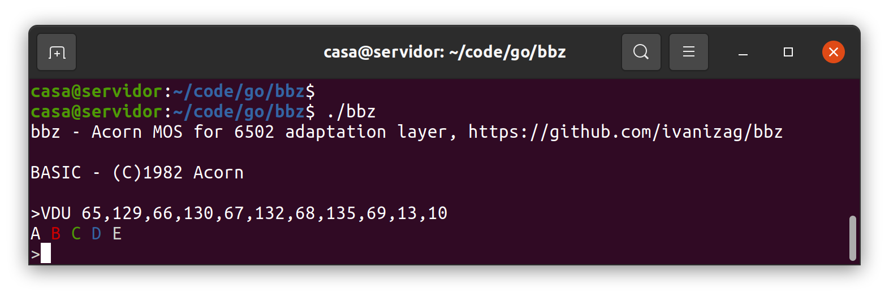

# bbz - Acorn MOS for 6502 adaptation layer

Used to run 6502 programs using the Acorn MOS on a modern operating system
as a console application. It runs BBC Micro language ROMs.

## What is this

This is a MOS for 6502 execution environment. It's a 6502 emulator that
intercepts the calls to the Acorm Machine Operating System (MOS) and
services them as a native console application on the host.

This is not a BBC Micro emulator. It does not emulate the BBC Micro
hardware, just the 6502 processor.

This program is heavily inspired on [Applecorn](https://github.com/bobbimanners/Applecorn), "a ProDOS application for the
Apple //e Enhanced which provides an environment for Acorn BBC Microcomputer
language ROMs to run."

References:
- BBC Microcomputer System User Guide: https://archive.org/details/BBCUG
- The Advanced User Guide for the BBC Microcomputer
- Applecorn source code: https://github.com/bobbimanners/Applecorn

## Features
- Some of the MOS entrypoints and VDU control codes are defined.
- Can run BBC BASIC and most of the language ROMs.
- Saves and loads files from the host filesystem.
- Does some of the mode 7 text coloring using ANSI escape codes on the terminal. Try `VDU 65,129,66,130,67,132,68,135,69,13,10` on BBC BASIC.
- OSCLI comands suported:
  - *QUIT: exit
  - *HELP
  - *FX
  - *HOST cmd: execute a command on the host OS. Example: `*HOST ls -la`

## Usage 

```
bbz [flags] [filename]
```

This first arguments is the filename of the ROM to run. With no arguments it
runs the BBC Basic ROM in `BASIC.ROM`.

Avaliable flags (to put before the ROM filename if present):

``` 
  -M	dump to the console the MOS calls including console I/O calls
  -c	dump to the console the CPU execution operations
  -m	dump to the console the MOS calls excluding console I/O calls
  -p	panic on not implemented MOS calls
```

## Usage example

Running BBC Basic:
```
$ ./bbz
bbz - Acorn MOS for 6502 adaptation layer, https://github.com/ivanizag/bbz

BASIC - (C)1982 Acorn

>PRINT "HELLO"
HELLO
>10 PRINT "HEY"
>RUN
HEY
>SAVE "TEST"
>NEW
>LOAD "TEST"
>LIST
   10 PRINT "HEY"
>X

Mistake
>^Csignal: interrupt
$ ls -l TEST
-rw-r--r-- 1 casa casa 14 jul 30 20:04 TEST
```

Log of the MOS calls (excluding the most verbose output API calls):
```
$ ./bbz -m ROMs/Forth_103.rom
bbz - Acorn MOS for 6502 adaptation layer, https://github.com/ivanizag/bbz

FORTH - (C) Acornsoft Ltd. 1983

COLD or WARM start (C/W)? C
[[[OSRDCH()=0x43]]]
[[[OSARGS('Get filing system',A=00,Y=00)= 4]]]
[[[OSBYTE82('Read machine high order address',X=0x58,Y=0x00) => (X=0xff,Y=0xff)]]]
[[[OSBYTE84('Read top of user mem',X=0x58,Y=0x00) => (X=0x00,Y=0x80)]]]
[[[OSBYTE83('Read bottom of user mem',X=0x58,Y=0x00) => (X=0x00,Y=0x0e)]]]


FORTH
OK
2 1 + .
[[[OSWORD00('read line',BUF=0x0542,range=20-ff, maxlen=80)='2 1 + .']]]
3 OK

```

Using mode 7 colors:



